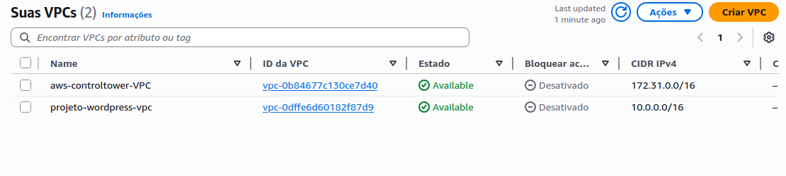
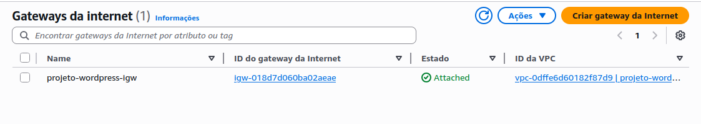
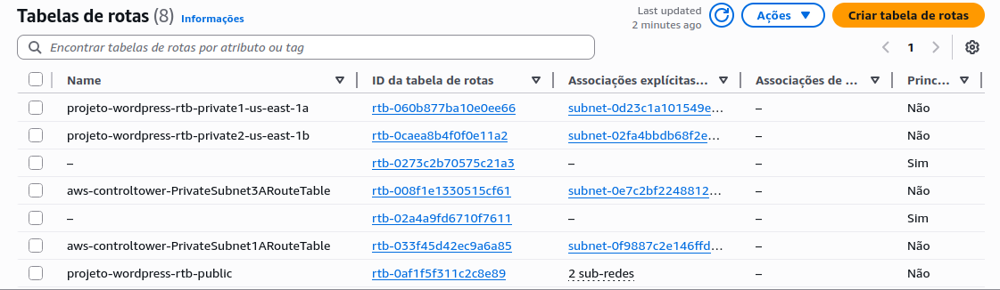
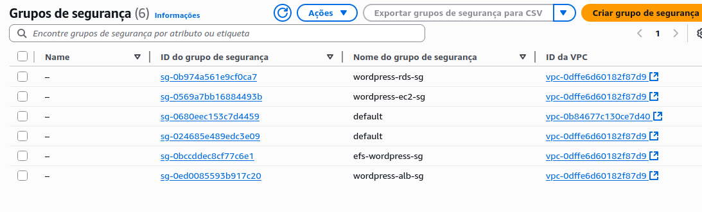
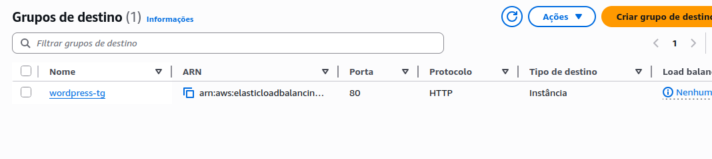
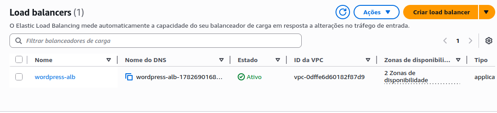
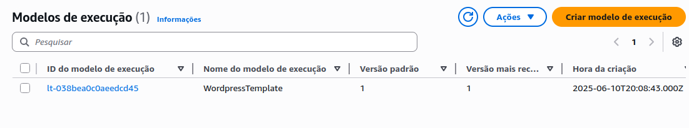

# 🚀 Projeto Compass: Deploy de WordPress com AWS (VPC, EC2, RDS, EFS e Load Balancer) 

Este projeto realiza o deploy automatizado de uma aplicação **WordPress** utilizando a infraestrutura da **AWS**, focando em **alta disponibilidade**, **persistência de dados** e **escalabilidade**.

## 📦 Arquitetura

A infraestrutura criada inclui os seguintes recursos:

- **VPC personalizada**
- **Security Groups**
- **RDS (MySQL)** para banco de dados
- **EC2 com Docker + Docker Compose** via *user-data*
- **EFS** para armazenamento dos arquivos estáticos do WordPress
- **Load Balancer** para distribuir o tráfego entre instâncias

## ⚙️ Etapas do Deploy

### 1. Criação da VPC

- No console AWS, vá até VPC, lá vamos criar nossa VPC, sub-redes, internet gateway e NAT gateway



- Em sub-redes, crie 2 sub-redes públicas e 2 sub-redes privadas


- Crie internet Gateway e tabelas de roteamento






- Criar NAT Gateway

### 2. Security Groups

- Criação de 04 SG para:
- ec2
- rds
- alb
- efs




### 2. RDS (MySQL)

- Em Aurora and RDS:

- Criar banco de dados
- Criação padrão do MySQL
- Escolher VPC e SG do rds criados anteriormente
- Após criação copiar os dados abaixo no **user-data** da EC2:

RDS_HOST:  
RDS_NAME:  
RDS_USER:  
RDS_PASSWORD:


### 3. EC2 com Docker

- Em EC2:

- Executar instância EC2 provisionada em sub-rede privada
- Escolhi AMI Amazon Linux2 e tipo t2.micro
- Escolher VPC e SG da ec2 criados anteriormente
- Par de chaves opcional
- Em detalhes avançados:
- Instalação automatizada via **user-data**:
  - Docker
  - Docker Compose
  - Deploy automático do container WordPress

### 4. EFS (Elastic File System)

- Em EFS:

- Criar sistemas de arquivos
- Escolher VPC criada anteriormente
- Copiar o DNS do EFS no **user-data** da instância EC2
- Volume configurado no Docker para persistência dos dados

### 5. Deploy do WordPress

- Container WordPress via **Docker Compose**, que foi criado no **user-data**
- Conexão com banco RDS (MySQL)
- Montagem do volume persistente via **EFS**

### 6. Load Balancer

- Em EC2, vá até Load Balancers:
- Criar Load Balancer, optei pelo Application Load Balancer
- Selecionar VPC criada anteriormente e SG do alb
- Criar um Target group






### 7. Launch Template

- Template criado para padronizar o provisionamento das instâncias EC2.



- Pode clonar EC2 criada anteriormente:
  - AMI (Amazon Linux2), tipo de instância (t2 micro) e par de chaves (opcional)
  - Script de **user-data** para instalar Docker, montar EFS e rodar o WordPress via Docker Compose
  - Segurança: associado ao security group que permite acesso **apenas do Load Balancer**
  - Interface de rede sem IP público (instância privada)

### 8. Auto Scaling Group (ASG)

- Grupo configurado para criar e gerenciar automaticamente as instâncias EC2 com base no Launch Template.


- Em EC2 vá até Auto Scaling Group:

- Selecionar o launch template criado no passo anterior 
- Utiliza sub-redes **privadas** para manter as instâncias não expostas.
- Vinculado ao **Target Group** do Load Balancer para distribuir o tráfego automaticamente.

- Parâmetros de escalabilidade escolhidos:
  - Capacidade mínima: 2 instância
  - Capacidade desejada: 2 instância
  - Capacidade máxima: 4

## 🚀 Como utilizar

1. **Clone o repositório**:
   ```bash
   git clone https://github.com/JuhLima89/wordpress
   cd seu-repositorio
   ```

2. **Edite os arquivos vazios no user-data(RDS e EFS)** com seus parâmetros personalizados.

3. **Suba a infraestrutura**:
   - VPC
   - SG
   - RDS
   - EC2 (com user-data configurado)
   - EFS
   - Load Balancer
   - Launch Template
   - Auto Scaling Group

4. **Acesse o WordPress via Load Balancer DNS**:
   ```bash
   http://<ALB-DNS>
   ```

## ✅ Recursos utilizados

- AWS VPC
- AWS Security Groups
- AWS EC2
- AWS RDS (MySQL)
- AWS EFS
- AWS Load Balancer
- Docker & Docker Compose
- Auto Scaling Group
